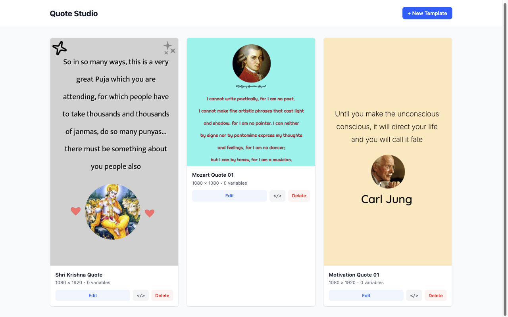

# Quote Imagen

A self-hosted, API-first image generation platform that enables bulk creation of branded images from pre-defined templates. Think of it as a self-hosted Bannerbear alternative with a Canva-like editor.


## 📸 Screenshots

### Template Gallery


### Template Editor


## ✨ Features

### Completed Features
- [x] **Web-based Template Editor** - Create and edit image templates with a Canva-like interface
- [x] **Canvas Settings Panel** - Configure resolution, dimensions, and background color
- [x] **Text Tools** - Add and style text with 150+ Google Fonts support
- [x] **Shape Tools** - Add rectangles, circles, and other shapes
- [x] **Image Upload** - Upload and place images on canvas
- [x] **Circle Frames** - Crop images into circular frames
- [x] **Icons Library** - 200+ icons from Iconify collection
- [x] **Custom SVG Graphics** - Pre-built decorative elements (stars, hearts, sparkles, etc.)
- [x] **Properties Panel** - Edit position, size, rotation, opacity, and styling
- [x] **Template CRUD** - Create, read, update, delete templates via API
- [x] **Undo/Redo** - Full history support for canvas operations
- [x] **Zoom Controls** - Zoom in/out for detailed editing
- [x] **Keyboard Shortcuts** - Delete, copy, paste support
- [x] **Responsive Layout** - Three-panel layout with collapsible sections
- [x] **MongoDB Integration** - Persistent template storage
- [x] **Docker Compose Setup** - Easy deployment configuration

### Future Development
- [ ] **Dynamic Text Placeholders** - Use `{{variable}}` syntax for bulk generation
- [ ] **Bulk Image Generation API** - Generate hundreds of images via REST API
- [ ] **Puppeteer Rendering** - Server-side pixel-perfect rendering
- [ ] **Image Cropping Modal** - Advanced image cropping with aspect ratio presets
- [ ] **Layers Panel** - Visual layer management with drag-and-drop ordering
- [ ] **Template Preview** - Preview with sample data before generation
- [ ] **API Key Authentication** - Secure API access
- [ ] **Rate Limiting** - Configurable request throttling
- [ ] **Webhook Support** - Callback notifications for job completion
- [ ] **Multiple Export Formats** - PNG, JPEG, WebP support

## 🏗️ Architecture

```
┌─────────────────────────────────────────────────────────────┐
│                      Docker Compose                          │
├─────────────────────────────────────────────────────────────┤
│  ┌──────────────┐    ┌──────────────┐    ┌──────────────┐   │
│  │   Frontend   │    │   Backend    │    │   Renderer   │   │
│  │  (Vite/React)│───▶│  (Node.js)   │───▶│  (Puppeteer) │   │
│  │  Port: 5173  │    │  Port: 3000  │    │   In-Process │   │
│  └──────────────┘    └──────┬───────┘    └──────────────┘   │
│                             │                                │
│                      ┌──────▼───────┐                       │
│                      │   MongoDB    │                       │
│                      │  Port: 27017 │                       │
│                      └──────────────┘                       │
└─────────────────────────────────────────────────────────────┘
```

## 🛠️ Tech Stack

| Layer | Technology | Purpose |
|-------|------------|---------|
| **Frontend** | React 18, Vite, TailwindCSS, Zustand | Interactive template editor |
| **Canvas** | Fabric.js 6 | Canvas manipulation and serialization |
| **Backend** | Node.js 20, Express.js | REST API and template management |
| **Rendering** | Puppeteer | Headless Chrome for pixel-perfect output |
| **Database** | MongoDB 7 | Template and job storage |
| **DevOps** | Docker Compose | Container orchestration |

## 🚀 Quick Start

### Prerequisites

- Node.js 20+
- MongoDB 7+ (or Docker)
- pnpm (recommended) or npm

### Development Setup

1. **Clone the repository**
   ```bash
   git clone https://github.com/yourusername/quote-imagen.git
   cd quote-imagen
   ```

2. **Install dependencies**
   ```bash
   # Install frontend dependencies
   cd packages/frontend && npm install

   # Install backend dependencies
   cd ../backend && npm install
   ```

3. **Configure environment**
   ```bash
   cp .env.example .env
   # Edit .env with your MongoDB URI and API key
   ```

4. **Start MongoDB** (if not using Docker)
   ```bash
   mongod --dbpath /path/to/data
   ```

5. **Start the development servers**
   ```bash
   # Terminal 1: Frontend
   cd packages/frontend && npm run dev

   # Terminal 2: Backend
   cd packages/backend && npm run dev
   ```

6. **Open the editor**
   Navigate to `http://localhost:5173`

### Docker Deployment

```bash
docker-compose up -d
```

## 📖 API Usage

### Create a Template

Templates are created through the web editor at `http://localhost:5173/editor`.

### Generate Images (Coming Soon)

```bash
curl -X POST http://localhost:3000/api/image-gen \
  -H "Content-Type: application/json" \
  -H "X-API-Key: your-api-key" \
  -d '{
    "templateId": "tmpl_abc123",
    "format": "png",
    "data": [
      { "headline": "Believe in yourself", "author": "Unknown" },
      { "headline": "Stay hungry, stay foolish", "author": "Steve Jobs" }
    ]
  }'
```

## 🔧 Configuration

### Environment Variables

| Variable | Description | Default |
|----------|-------------|---------|
| `API_PORT` | Backend API port | `3000` |
| `API_KEY` | API key for authentication | - |
| `MONGO_URI` | MongoDB connection string | `mongodb://localhost:27017/quote-imagen` |
| `RENDER_TIMEOUT_MS` | Puppeteer render timeout | `30000` |
| `OUTPUT_DIR` | Directory for generated images | `/app/output` |

## 📁 Project Structure

```
quote-imagen/
├── docker-compose.yml
├── .env.example
├── packages/
│   ├── frontend/              # Vite + React app
│   │   ├── src/
│   │   │   ├── components/
│   │   │   │   ├── canvas/    # Canvas editor components
│   │   │   │   ├── panels/    # Sidebar panels
│   │   │   │   ├── modals/    # Modal dialogs
│   │   │   │   ├── layout/    # Layout components
│   │   │   │   └── ui/        # Reusable UI components
│   │   │   ├── stores/        # Zustand stores
│   │   │   ├── pages/         # Page components
│   │   │   ├── data/          # Static data (fonts, icons, graphics)
│   │   │   └── lib/           # Utilities and API client
│   │   └── package.json
│   │
│   └── backend/               # Node.js API
│       ├── src/
│       │   ├── routes/        # API routes
│       │   ├── services/      # Business logic
│       │   ├── models/        # MongoDB models
│       │   └── app.ts         # Express app
│       └── package.json
│
├── output/                    # Generated images
├── screenshots/               # Documentation screenshots
└── doc/                       # Documentation
```

## 🎨 Template Variables

Mark text elements as dynamic using the `{{variable}}` syntax:

1. **In the editor**: Type `{{headline}}` in a text box
2. **In API calls**: Provide `{ "headline": "Your text" }` in the data array

The system automatically detects and extracts variable names when saving templates.

## 🔒 Security Considerations

- API key authentication is required for all `/api/image-gen` requests
- Input sanitization prevents XSS in rendered templates
- Docker containers should have memory limits to prevent resource exhaustion
- For production, configure proper CORS and rate limiting

## 📊 Performance Targets

| Metric | Target |
|--------|--------|
| Template Save/Load | < 500ms |
| Single Image Render | < 3s |
| Batch (10 images) | < 20s |
| Throughput | 100 images/hour |

## 🤝 Contributing

Contributions are welcome! Please read our contributing guidelines before submitting PRs.

1. Fork the repository
2. Create a feature branch (`git checkout -b feature/amazing-feature`)
3. Commit your changes (`git commit -m 'Add amazing feature'`)
4. Push to the branch (`git push origin feature/amazing-feature`)
5. Open a Pull Request

## 📄 License

This project is licensed under the MIT License - see the [LICENSE](LICENSE) file for details.

## 🙏 Credits & Acknowledgments

### Development Team
- **Sahaja Yoga Vietnam** - Project sponsor and spiritual guidance
- **Hung Bui** - Lead Developer (duyhunghd6@gmail.com)

### Technologies & Libraries
- [Fabric.js](https://fabricjs.com/) - Powerful HTML5 canvas library
- [Puppeteer](https://pptr.dev/) - Headless Chrome for server-side rendering
- [React](https://react.dev/) - UI framework
- [Vite](https://vitejs.dev/) - Build tool
- [TailwindCSS](https://tailwindcss.com/) - Utility-first CSS framework
- [Zustand](https://zustand-demo.pmnd.rs/) - State management
- [Iconify](https://iconify.design/) - Icon library
- [ajpgtech/design-editor](https://github.com/ajpgtech/design-editor) - Inspiration for the editor architecture

---

**Current Status**: Frontend has been tested and is functional. Backend is awaiting smoke testing.

*Jai Shri Mataji* 🙏
